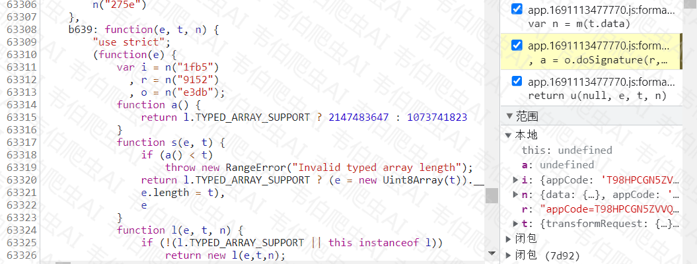

# 医保服务平台SM国密逆向分析_webpack精简扣取思路

# 声明

本文章中所有内容仅供学习交流，抓包内容、敏感网址、数据接口均已做脱敏处理，严禁用于商业用途和非法用途，否则由此产生的一切后果均与作者无关，若有侵权，请联系我立即删除！

# 逆向目标

- 目标：国家医保服务平台
- 请求接口：`aHR0cHM6Ly9mdXd1Lm5oc2EuZ292LmNuL25hdGlvbmFsSGFsbFN0LyMvc2VhcmNoL21lZGljYWw/Y29kZT05MDAwMCZmbGFnPWZhbHNlJmdiRmxhZz10cnVl`
- 逆向参数：Request Payload 的 `encData、signData、appCode` 参数；Request Headers 的 `"x-tif-nonce"、"x-tif-timestamp"、"x-tif-signature"、"x-tif-paasid"` 等参数。

# 逆向过程

## 抓包分析

访问目标请求接口，并手动翻页后，捕获到的请求包如下：


对应响应如下：


以上红色箭头标出的便是本次分析的主要参数。

## 参数逆向

直接全局搜索 `signData`，显而易见，所有加密参数都在这里：


主函数：

```js
// 生成所有加密参数
function EncryptedData(data, url) {


    // h = Object(i.a)()
    function i() {
        var e,
            t,
            n,
            i = "abcdefghijklmnopqrstuvwxyzABCDEFGHIJKLMNOPQRSTUVWXYZ",
            r = "0123456789";
        return e = o(6, "abcdefghijklmnopqrstuvwxyzABCDEFGHIJKLMNOPQRSTUVWXYZ0123456789"),
            t = o(1, i),
            n = o(1, r),
        t + n + e;

        function o(e, t) {
            e = e || 32;
            for (var n = "", i = 0; i < e; i++)
                n += t.charAt(Math.ceil(1e3 * Math.random()) % t.length);
            return n
        }
    }

    var r = createMethod(),
        s = Math.ceil((new Date).getTime() / 1e3),
        h = i(),
        f = s + h + s;
    // 加密所需参数
    var t = {
        "transformRequest": {},
        "transformResponse": {},
        "timeout": 30000,
        "xsrfCookieName": "XSRF-TOKEN",
        "xsrfHeaderName": "X-XSRF-TOKEN",
        "maxContentLength": -1,
        "headers": {
            "common": {
                "Accept": "application/json, text/plain, */*"
            },
            "delete": {},
            "get": {},
            "head": {},
            "post": {
                "Content-Type": "application/x-www-form-urlencoded"
            },
            "put": {
                "Content-Type": "application/x-www-form-urlencoded"
            },
            "patch": {
                "Content-Type": "application/x-www-form-urlencoded"
            },
            "Accept": "application/json",
            "Content-Type": "application/json",
            "channel": "web"
        },
        "withCredentials": false,
        "baseURL": "/ebus/fuwu/api",
        "method": "post",
        "url": url,
        "data": data
    };
    t.headers["x-tif-paasid"] = l.paasId,
        t.headers["x-tif-signature"] = r(f),
        t.headers["x-tif-timestamp"] = s,
        t.headers["x-tif-nonce"] = h,
        t.headers.Accept = "application/json",
        t.headers.contentType = "application/x-www-form-urlencoded"
    t.data = {
        data: t.data || {}
    },
        t.data.appCode = l.appCode,
        t.data.version = l.version,
        t.data.encType = "SM4",
        t.data.signType = "SM2",
        t.data.timestamp = s,
        t.data.signData = function (t) {
            var n = m(t.data),
                i = p(n);
            i.data = p(i.data);
            var r = v(i),
                // 注意: 此处的d这个值不要取源码中的，否则会出错，必须取运行过程中的，且观察发现这个值保持不变
                // 因为d = l.privateKey，所以此处将“009c4a35d9aca4c68f1a3fa89c93684347205a4d84dc260558a049869709ac0b42”赋值给它
                a = sm2.doSignature(r, d, {
                    hash: !0
                });
            return e_.Buffer.from(a, "hex").toString("base64")
        }
        (t)
    t.data.data = {
        encData: function (e, t) {
            switch (e.toUpperCase()) {
                case "SM4":
                    return function (e) {
                        var t = e.data.data && JSON.stringify(e.data.data),
                            n = A(t);
                        e.data.appCode && e.data.appCode !== u && (u = e.data.appCode);
                        var i = y(u, c),
                            r = b(i, n);
                        return r.toUpperCase()
                    }
                    (t)
            }
        }
        ("SM4", t)
    }
    // t.data = JSON.stringify({
    // data: t.data
    // })
    return t
}
```

## signData


其中的m，p，v，直接打断点进去函数内部整体抠出来即可。

### o对象

进入o.doSignature函数内部，可以看到它是webpack结构，找到加载器，将模块"4d09"抠出即可。


js扣取代码参见：https://github.com/victory-volunteer/fuwu_nhsa/blob/main/doSignature.js

### e对象

进入e.from函数内部，可以看到它也是webpack结构，并且和o对象同处加载器，将模块'b639'抠出即可。



js扣取代码参见：https://github.com/victory-volunteer/fuwu_nhsa/blob/main/from.js

### 总结

扣取m，p，v函数，将上面结合一下：

完整扣取signData代码参见：https://github.com/victory-volunteer/fuwu_nhsa/blob/main/signData.js

## encData

encData函数中固定传参"SM4"，故走下面的逻辑：


主要功能函数如下：（使用上方的sm4和e_即可）

```js
function b(t, n) {
    var i = 16 - parseInt(n.length % 16);
    n = n.concat(new Array(i).fill(i));
    var r = sm4.encrypt(n, t);
    return e_.Buffer.from(r).toString("hex")
}
```

## 响应内容解密

```js
//对加密结果进行解密
t_ = {
    "code": 0,
    "data": {
        "signData": "SZc1s5K9zJFn6XVkOF9nX5QMiZ+IAas29wvvtJBn4THLaZRmzpBAYubdnhBwMzzNNPB1klkN+qBPM+xP96UIew==",
        "encType": "SM4",
        "data": {
            "encData": "943195DDA5E5337E08E0A527071CC637E0074CBD73D293A3643B2199C79561872E19ABE7BB2600D23E9CDB14C1A75194C1D3C735D2DCC50E297311A423B72BF0AE4781F770874C1AC923AD26618311F1E72934E0FFBB639208EEADCEC171768624E540918807252F0FF6D4D741C14BF47CE0B648858ADC465332E5D5D024525EC2F9191071BED9CE58C3B46B0259015C9D3F9A6A7761254178DAB215456B459C6CDC054BD1257D8B5533060F9D258878AFE4FEBCA46E77AEE93EA481D28477D599A6A93A947845803634A2E3B060BF92200162303EC72ABC55B1B0A9F40A4ECB254AE970E8A34298B214FAF895E5E814E226A5F27791FBF0973885F9F4DD107B99525EE7B77CF1E63FB487A3C65AC27A6682466E5BE6D2F4FDE3379DC17A975C1707716976D16F897CEB6D28BED95D45C35EFD7062F6E7AA59FB2418F7AB3A5AE5E9FE694C3A9CF22D96E2A29E380AB42277A817E3B86544C8D73379B01D53731C37A8DBD4CF0B2127C10D6437F182906D629D14C0C6C882AE5EE7EB81B75E1289D4A992DD589C9C810E7C0D354636819E570E8447499F0FF82A9D9A1CDA881871C0681A9F9D1801580D74C2822A9CCF755AB173FB47E63C0523E283147942BD3427E43991ED3D7C16A04C220C99E4B631DED5DEE30078FB54A1178521E7E4E7C3C51AC01C8E63F13178CB7048EF55E30E72DB72A1085E8512F7ADF4C50E01DD8827EA54434BB2BB3F695A394CECBC8169E2FAA2A0B387E2A9FADDCBB44C80B3BAC26DE7F881DE29149A21B29281385C1C8F3FDF1A6C1EBE2034B04EDC8E891E0A9A93128333D3F2841DA9A15915E46DDBAC766BD5C0A99AC2B96F739A8E4762C3C71BB555D27057187CF0BF4172E3B7C3FAC70A41BCF0C1C901CD082D1E6A38D3C9127C1DCA6E4A01AF51D36FCE84CA29824013CBF7DEF132073722DA86365BC464999552164FC93D4B0DE9C67ACC85720890CFDEBB03A6AF0A5040826450C02DCAEEC96F345FD71B474DD455156724DE604634369966086A753493B93459C156CD1D7B0EAC2627586E5717014DCE9F03B69BB560CDD96221F787A803FEAE3827D0E6CE2A2EB8BA32AF7F8E961D00F3720E6812453B72DCA4AE6443703CDCF77841004B6FEE50D2B9FE2494A3A1DFAF89B787F92C4523C13EEC28EE413F48E6B52EAAAEB8C5C7AF5FACA27FC296F7EBE4B423A762BCC275E1815B82C29B60AF962625E2EDEF651766FCAFD7CCD294C5C8660EB11E7FFF91129F4183EDBCDA7CB28C893DB91D21C33445DF1E140EB21FB7A00E4011E692BB95F2C02CD49FF2EED410029204A995BE1850CF211035F8D2AC67FB3B38DC76925B4A1E72442195B34F1ED065348B94C16C969E67D13AACE45E7ABF406AA2EA9881B6EB91F042E50EBCA8B92C87664F36BD2C4BC95BBA15817F5DAC80DE623C39F7ADB038A27CB8B9A902DF934BD18D736866610B630423A2EBCF7A1C45C2E37636E69D979DB637886C359B7ED88DBE5D081DD4793D69833F56CD1D7B0EAC2627586E5717014DCE9FB649142AF54B104FEC3B8D1DA1027ACFD49AA860FDF4E62266EBD7F4CB8900CA720E6812453B72DCA4AE6443703CDCF77841004B6FEE50D2B9FE2494A3A1DFAF0786770A98ACE50A2CF691C33B2B23BBD8D0D510C6DFB84041B866632ABDEBCD1027D6D0C97B1C8CF52C7B1B1CDC45873F8B94CCCB77E78D20CBDCC073BECEFC620C069933DED43E99FC40E0C83B263B2BA8645F994EBF0B8209BD1DA6CFFD86024C2704853828C84D551E814D02EAFC52D48F2BFE9C488CBF934A35AEDD2D1A5397AC08489FD76B7354E81B3920D61BB539CE43CE13DB232D25B569C10BA0AB030A19E7BE0C16ECEEECB12E6733A23D70A6989DDA42A5E23A3DDFDCBA67D1F62AD87EBB69088B42A4002562986DC8249B04B78C1661BC8FC97D36D892D828B0A4F7237FC6895BE73F5EC7AFABCC6332AD85A7427E1137608894D3F8888256CFD0CE9EF4AB64B7D388D84D6A8C6BA9303B0ECCA2A0F34F8022B40ECD85A53AD2E13453881245615C917D409D2D01E959BEC822ADF8F16D282E2E5FAE93A3DD5A47EFD0AA160EB128AF9160AB477506D3DCB35A83E4C9E4F33E9681D786F3935E031BC9317C526090AD813BFB5FBA35ECF84CA83688A4B9F468EA7D052F98DBF470A09C3CC6C27A1BF718AD06FE629FF52E5A56E10BE6356A0D6B78ADE0594BD780F620CEF65F3F1744412C847004246F3F8B94CCCB77E78D20CBDCC073BECEFCCA8D37A0DB0D37BDD25E5C484DCC5F4E75A5EBF8ADDD0B19C73ED56A810011A868D20673C76CBC012D1AF4D1DB0E385D9A230E7AA083FAF5A98E6A8793F5D09CA6857200B5FD24C93A841F6A343420EB441DC0FBA6953D0EF058369B2D929C23129E5149F87D797291136B7BDD330820720890CFDEBB03A6AF0A5040826450C0A5237F814EEF2531D2F39A4077AECD17792CDA7DBD13A946B4144AD5763836E63F1AB40FD2D418277B785C7127733CD101CD6BE519A4AAE1CBA9D04395F967DAFEAF28CFC0CC9AC4EE509516A31839F79319E17D200D8004469489798C6D79CB39FD924DC8D33D22D3C9F89BD5CE8866B79CF95055FB001DF50695A2B92C77476F912E9D519C71BF4C3947D52473A8199E469FA78F977631F3541E6FF946D4D69F09DCBDE4D1E789E98A176E0AD5C1A3CB43F02A280822D49231372D85413E871D39ADC8C9833E3DD81B979F2FCD049932E7E83C37B93276E783823071CD5941ACFCA071775D26C2CFC0F8EFC8AFE87F0BD9507126BE6CB95D4F0AFE5B43D34CC6CFA9061A2F2966B8C42F35868A601F451B5D80DAB422BFEF26980E86C77E5BEB263B055E416EA32B0B40B9C15AE65169E5C1DD5F1379AF28286F81DFDD3DE5A8C49874E30A556DE3EB37FB2DBF9535693DFADD3A33EDED3DC62D716431D90D4C12CC0A2A69D07C933586E2083F6B191265E8A5D55546C52583F9ADC687D443BC8953DE3319282D2FAFD11826C9C6CE72F421C3E710E678A04622167AA032CF39BF52116C4EBA9A22BA3E0516BBBFDCFEAF28CFC0CC9AC4EE509516A31839F76FC2C08148C0BE59FF0152474C6FAC79338B040EEA942986218D8748F6877A4CB79CF95055FB001DF50695A2B92C77476F912E9D519C71BF4C3947D52473A8199E469FA78F977631F3541E6FF946D4D69F09DCBDE4D1E789E98A176E0AD5C1A3CB43F02A280822D49231372D85413E871D39ADC8C9833E3DD81B979F2FCD049932E7E83C37B93276E783823071CD594164D034478E333CA82AA10BA1D83F8B3604A754B82793F9F82CC150DD85590C90DF62C8F6B21946793B2A1B9D5FFC4ADD8E2EC9ACFF94320B7B9858B5218DA5EB02B30BBE980B88C611582DC267223AAAAB157A31405DA6C817500CC6925C0251D9096C7C2120531BC96EECCFC7DE250BDB10330886ED9E8AF26386C7B35769AB513CFB8107C506C5643EB47F13BFEA4D9BD790AB89414CA2CA9132B7F58953CC1594F60D1695CB0C94E9F6AE38108E41FC80D814B0B5E148FE839DAD6014E8A740439C33CD3D0016858E5D41D6DBB04F95543525D78286EE50E4104CDFE764E3DD5816BE929C5F20C26ACF9050FA83A3BFC7792CD37824AF082F6623148B39F6907228575692F06822201465AEF3F8448C061A83BE8A5BA89EEA3D2CB66EC4090D84CF6CC19165511DC5165D9C8CA80226D94DF9A9A8DED38E5BD02F833FE880B7D36FC3CF8326AA1A2E8DF22A9D967AAD0D3D99C54A971331C1310095F1798A6710495917ED3111C5AAE234A9062C11724FA15B5FB39329D98A2E221ED6D0A3CE1EE612EB5DE8D219DB07E307F521C2D03D1D4E2FB7DF972493679EF395559B3C244A128BF389B9EBD3AAEEE4592D1DBCFDCF8622ABD4CD5CC8BE9BBF5F5AA30A0A0F9D54A0B9AF7CDE2719B43D519AB004E462B1AC835F03A779BE611D9708569993F6DC7131B599E74C06144B614510CB47D109B29CFA5EBA334626ACA5350B472D2397A8856923E3239B7D15C1BD569711A0DE9335C9136B95C4FDFD80FDAD3FA471D3FD2A70807E7AE1791FC01366DB2E14A2D69684305EF81A2D103639AECEF23ECC48EA6A1D649263556874A24DBC0F97FEDB7061F7755691EE7725559D746F9B0D04CADB2E448FB48352670839EF7B27C000252E87510FAA194D7C5F5FAC709C20EDE563E9C04289771F62A42300FBE8F7FD527D9D837359909CE27365D87627E132D6E8281823416F1B4690F92E32CA7F4146B76533E7D46EABC4B4D69F62A30217141CC6E437DBCDD5F1AD05EA8E085579280DF3487A09FF4DBEB092A1F65FE0A0CFC022375844965A7702878F859940DE7A27A835494EF11EC9D75612416D0E2DC30810864C72F26F5EF2EAFF8B361C01D88C567D31F6F59D061FB702C13825D1F299CE623F61A38DBB1C15DA402421D02C4EDAF50179BDA4B4EA383F91C4675CA6BD9F6CD6D2A8C7BDB61265E8A5D55546C52583F9ADC687D443051D97274CCBB6F85CD825DEFE7423B8613FDE89530D528666C7C692CCA6986E5080FF8D4FEC1CD7CCAF5B74C30B354FBBD4B5F7024EA301225F6EDF0749E352459DF82F7C6318177FBDD671803F1095E9E9DFCC3555453A28D11FD63B559614FDAB509CE5C10DB60B44C94C6C982EFE4061CADCA3D2B15BC97FB1190936E8FD156D903ADB5FA39E28CAC25D9DAE38B60769CEB20763FCDC352BC8FB482C99DA417B8840242DF9095293D8240B3736D14EAD94C3C34F169D5E90A739BC63D798CD4A507A0E8E170F12A298680886A75948E6AF956295006B88319A4B27A71E0110FEB3704022111A76EC7ACA63260F9AE971E31DEAAE71A4911B58CD02CDE2D76328EAD0B597A91D1D407485C817212735ABD8D058E8CA945D7F84C4E50A414EC3767CB9A068F9DBDD2BEB65E50241F9455B8CD1F7BAB53B7F85BF202DACC895084B45D91488D1E271709C7B456BDD89438620120AA0D3973868D903D927053699A5AC1357B20BDA1A3BA0A68125D9BAB99B5B5546D95945250C56FA6D0DB1EF416C736EB53B0B76398AF199D4F799E4E13453881245615C917D409D2D01E959EECC4179C63C9BE6BFE90C0DB6F12228C16891DD6CB4CD7C7A7BA079C4F6AB4BDCB35A83E4C9E4F33E9681D786F3935EB14A3658E951F9A47D28708C696690B2B0C76911226852EA9196912353724E2BEA4535D8B24803E05E3B25FA4445DF5CED70BE3D6293B9807904B462B29F85A35A8C1CC2A71203490517CC9300F6A764532BF5A1D32FFC047019F9D7866651E238581AD8CE3F242D464971FC8D67F5663CFA7831B19CEF94FA56E44B7429F5625AFBDFF5EF9D3D61C5FBE20C54967CFFD14F81E64A0E5B98123CAC8FAE21DE699E7B8CDC07864CDB06FBDD3CD8F17AAF"
        },
        "signType": "SM2",
        "appCode": "T98HPCGN5ZVVQBS8LZQNOAEXVI9GYHKQ",
        "version": "1.0.0",
        "timestamp": "1690956850490"
    },
    "message": "成功",
    "timestamp": "1690956850",
    "type": "success"
}
t_1 = {'code': 0, 'data': {'signData': 'EgvLsrQSFa3/mgVv4V1uGUjcYxbkhH8y6tMInOitlv7B2DpwxnZ1S+iW+vfqUGF455GIyHGj0jFXvXt4ecYqfw==', 'encType': 'SM4', 'data': {'encData': '943195DDA5E5337E08E0A527071CC637E0074CBD73D293A3643B2199C79561872E19ABE7BB2600D23E9CDB14C1A75194C1D3C735D2DCC50E297311A423B72BF0AE4781F770874C1AC923AD26618311F1E72934E0FFBB639208EEADCEC17176865992EA3D73E612B17DA2CC7ED5812681C7A50DE15C5AA096A763F1DDF34E9CF192ADC78F0677FEF53DCC12BE9F64BE66E9CE34A687712D16B2D57EB6E34CA32B7813DA9D8644C332964B12448909602296F5C02636D98E8040CE1402B36E59F77044D8ABDCBC5D93DEAE08B7A889FA33C5EF028B7536641722810878A5D61686378B1CF48A4B76D998471C5B75A6555A6A2AA922AA6AD0E9F9E23B7B09A98992DEEFEF38F38D04808568917814FCEE9F316DF391FBBC8E034DA973E3DA899F91AAE37735159C27012A8FC3C9793A87A0EE16E23F40589F5552455A5C6BAD5DEF5AA802F2438D1CC06CD3963867DADDA65D9FC8261760EDAFC4947A42F62785FEDA29576435FBAB0C0BD1C24719524E0869AAA90CA0DF9503A2FF08001A12CAD55B3C018DF147B5909F95072DE200039AB21A32D44ADD168A538889A5203D353A8917FEFF8320B172616B76637615E4E08D12C63D77565B34B23D6AD3DA7AF8549D746F9B0D04CADB2E448FB4835267086BE1006101F82823FC2D95C4863E5216F9041B89CFA1DBF33F3643F6460B020D35B61A43A5FB32406B701618A3ACB0478B10173C88EC666A44EF795465D0FF7E92DA07444DA1526331109FAA4B5190B557CEF50FD58D38AC57E5DB8AA0DCD35880E005002099DDE1833F6795888C4D3375A5EBF8ADDD0B19C73ED56A810011A868D20673C76CBC012D1AF4D1DB0E385D9A230E7AA083FAF5A98E6A8793F5D09CA6857200B5FD24C93A841F6A343420EB441DC0FBA6953D0EF058369B2D929C23129E5149F87D797291136B7BDD33082048D8D9EAE4F976F23839CE0BB5E61DD30487FBE45705089FB315CE71A9238736171EFABD912510EC36C4825AF347168CD9E8F9C7C7C8596BB8AFBFC8FDEF813B6355C14CAB7CC7DA8B04D0C9D3D49D4E78FDC98DD46B9135B67351449AE5B042C7FD310D1A423CA9D83869CDBF3DEA2CC0B38F206227CB30CBB795AD430E977299E9DBDB0AF83A01EC75C487818AAC19FF7D5613F7510105BEAA33BF620888FC9D746F9B0D04CADB2E448FB4835267086BE1006101F82823FC2D95C4863E5216F9041B89CFA1DBF33F3643F6460B020D35B61A43A5FB32406B701618A3ACB0478B10173C88EC666A44EF795465D0FF7E92DA07444DA1526331109FAA4B5190B557CEF50FD58D38AC57E5DB8AA0DCD3583FB2DF781AB2E229D75F25C9842AC4DB75A5EBF8ADDD0B19C73ED56A810011A868D20673C76CBC012D1AF4D1DB0E385D9A230E7AA083FAF5A98E6A8793F5D09CA6857200B5FD24C93A841F6A343420EB441DC0FBA6953D0EF058369B2D929C23129E5149F87D797291136B7BDD3308200337EA783660F54C7F1BF31B1D504E55FECCC0F4129F855D1A9F6188D33FE032F705EA6C19FD22D7D15E4FBE0F182F3E0EFCD482E79098E9E57EC6B8A7933902EC02E5930E38EA98AA626DA1469C216C5EB5BC7DD728E0B25770DADAA1AC0EF590DD15712CEFFF967323ED78C2140346E82388761328184E235BA8BE1D4B9AB6562D3EBF97AAAAC35EB396B06A9A75523C167B43EBAC6ADED63C416EE6750547EC2C6157EEC2FE417F78F2EC2D811181F7A54BF4FA26775B28052E72F0B18E74755AB173FB47E63C0523E283147942BDB1BFD8EEB67BD6C59C894ED9CAC8CCF4633C8E7B20147EAF7BA82CE63927249A647E929EFDA71CFAC55AB343672373211B3FC3613E8405ED68FB03C9758D866898070B0160B2A19B32E913D7BA20375A9084AC0681A2FAA432B0428504BB98367134AF0D70C15F4982C673CF11B4D6AC48E6AF956295006B88319A4B27A71E0110FEB3704022111A76EC7ACA63260F9AE971E31DEAAE71A4911B58CD02CDE2D76328EAD0B597A91D1D407485C817212735ABD8D058E8CA945D7F84C4E50A414EC3767CB9A068F9DBDD2BEB65E50241F9A88A09739D4795ECA29D91373561A040F9041B89CFA1DBF33F3643F6460B020DBAB62665C84C63C3494A6DD9B38013C7CB36CB4547C3A3DD6DF59E5C6A32D97C81949DA0B67FC162E4B8A43690D3523B1A08FFA3114FAC49514369718112555982CE4BCFAA18AFA273A18E772377380E934B1B3380FBEFCF687381C061E2D5EC1E9CCB24AED6401D4A1A480669344A9343DE9A4E98FFD6598D5B9EA313D5BEB3755AB173FB47E63C0523E283147942BD702FD3B39FC7BFECB86C0906C90940FDD7367390C6CA3F21A0C95DA7733FA1AE9F02D24845E65C0B4971CADECBA0AE69BC64AFBF148EAB67857929087F61126632E7E83C37B93276E783823071CD594138F07E136B19A67E661555DC37E6B2B304A754B82793F9F82CC150DD85590C90DF62C8F6B21946793B2A1B9D5FFC4ADD8E2EC9ACFF94320B7B9858B5218DA5EB02B30BBE980B88C611582DC267223AAAAB157A31405DA6C817500CC6925C0251D9096C7C2120531BC96EECCFC7DE250B67FC85A8B17DC5F9ACCD34E9C3A8FA728C26057046B8E6EDAD29B2DD5B18F22E81E44D5A7614ECA6CAB1F83AAF3CCDE457EF5554E70DF20419FB905BF6F98DDA2054EE919242F2384A909DAF862FB152A1DE3227E0EC2680E412CB5932E3CF47B8D70A06841EC62618E83A719B0F94D2F71E617BD075D07B14CDA5702024EB1FBB8BE77DBEF1902725456EE4A66507705754DDCE6AE7BA156F43AEE4E01BD0AC932CA82DF2CA365EFB381A7EBCB39003E18A23F1DACE59478E521E6B7DE9D865864C6B6B7D459FC89CE156D9B6C4C84F25B500C6FA13F3F7D6FCE5DCA0B7DE08BC64AFBF148EAB67857929087F61126632E7E83C37B93276E783823071CD59410C58A5FE0C9906462A65BC5C865AE3910BD9507126BE6CB95D4F0AFE5B43D34CC6CFA9061A2F2966B8C42F35868A601F451B5D80DAB422BFEF26980E86C77E5BEB263B055E416EA32B0B40B9C15AE65169E5C1DD5F1379AF28286F81DFDD3DE5A8C49874E30A556DE3EB37FB2DBF9535322C0618422AB53D95366EBC4835854ED7E1130FB298BB474B76FC04849387371265E8A5D55546C52583F9ADC687D443FDA1B669F1A295D666732DF9161C4C5C5C3596850302D8B6847A6DCB7CD0843EFC98088A4E36F0A98D5B81D029C6A7FE312B355E94DCD4CCA05BB0E3D6776243E43D2F5708DF3315514B31EBAA5BECAD0E93E14F26B1EEB0E3F563B82808EBA6E9E9DFCC3555453A28D11FD63B559614FDAB509CE5C10DB60B44C94C6C982EFE4061CADCA3D2B15BC97FB1190936E8FD156D903ADB5FA39E28CAC25D9DAE38B602F379B328BD13C76C9EC57205E6F7879084AC0681A2FAA432B0428504BB9836237C6BF48BF9B7BB0512A95601E925ACCE1EE612EB5DE8D219DB07E307F521C2D03D1D4E2FB7DF972493679EF395559B3C244A128BF389B9EBD3AAEEE4592D1DBCFDCF8622ABD4CD5CC8BE9BBF5F5AA30A0A0F9D54A0B9AF7CDE2719B43D519AB004E462B1AC835F03A779BE611D9708D636BFE5964FA8F3074A68535EAA17B08AD7DE7665E91B7DF382F27DEC9C1D5C9B04B78C1661BC8FC97D36D892D828B0A4F7237FC6895BE73F5EC7AFABCC6332F259832280B67DF67ABB99EDC0A6004D5E9BE0E7E53AD13C1E1ADF36B28F9C170487FBE45705089FB315CE71A923873631F2FE28BA6E6B27EC1A30D64468ADCE0C4644003574079CE624221DFEF37CD0A5B606123C726B31D8DBF77A76E552AE5CF465AB0A13D58DC1CD7BEAF0984032C7242F2DF2150C07D184E5AD8E76FF658BD57B66B08C9517688C11CB77E0FFDA4E620A89BAB896DFB0FB6A08B7180801D3EC6CA0C2C52714EABDDC905E6A337160B49AE96307FFC0AE50A269AA81FCBBC98B6EB8989D8202AA3516FFA29B3A1A7B84B010A5C60DD27CB6FFFE99F4EB3B0BD9507126BE6CB95D4F0AFE5B43D34CC6CFA9061A2F2966B8C42F35868A601F451B5D80DAB422BFEF26980E86C77E5BEB263B055E416EA32B0B40B9C15AE65169E5C1DD5F1379AF28286F81DFDD3DE5A8C49874E30A556DE3EB37FB2DBF95355AC69E0604DF6498BCD7DC31BCD4820CC050AA2CF5E355AEC84AB2DD737D14C04AEB889419C9651EB880E6575F4ACA6D895567E144B0F96D566A48F415635CF48700CB9E3C51F100F327B417B4DD6420F0953A4EDE0A2F5CDFBFF56DE304534FD8868239447FE353E9C4597E41DA174AD89B77E10E7F6449CF5A96A14B367DE84A365B5A8C6B944099C0BB94756C1238C3FE3CA5DE7927A58AD7BA6FAA25807E8E5693B874AEADFA99E84D0E90D2150BE9E9DFCC3555453A28D11FD63B559614FDAB509CE5C10DB60B44C94C6C982EFE4061CADCA3D2B15BC97FB1190936E8FD156D903ADB5FA39E28CAC25D9DAE38B602F379B328BD13C76C9EC57205E6F7879084AC0681A2FAA432B0428504BB9836548C70D509BEF12D2CE20C72A027236F59C29CA9B1A45F47A0D80B062F1C87F7D03D1D4E2FB7DF972493679EF395559B3C244A128BF389B9EBD3AAEEE4592D1DBCFDCF8622ABD4CD5CC8BE9BBF5F5AA30A0A0F9D54A0B9AF7CDE2719B43D519AB004E462B1AC835F03A779BE611D9708832B6C462DBFCD13432B1C2B44C02B1F41FB1E7A8EB2DB4B072683B2BD9194D7A0BFD6D66CB793CB3D53BD6C579FC771895567E144B0F96D566A48F415635CF4832B6C462DBFCD13432B1C2B44C02B1F41FB1E7A8EB2DB4B072683B2BD9194D7953F3821C2BF1E5E21F05C3EEACAF93E312B355E94DCD4CCA05BB0E3D67762437A4032D5FE26FA61C3BC1FC053A9E9FE4BAED3ACF4CCFEDBC1A8411D078DFB1E48943DA72424B448CDC6296AE2DC9D71F2F836EA57FAF8AB6ED7A386C306A531B018D4F657901A72FCF2CCF35AF4A22E647E929EFDA71CFAC55AB343672373218D531D3583541174B41D1715136438B46710495917ED3111C5AAE234A9062C11AB5E9F583CE19E39807D90A6A700187E4500CD3034813EC3758884D4FF670E83EC778B189EF445FA79737DB5BE38133F09D5B5BA44FB74F5342DF1063E48C9E0834A8283E5FD0AD48AAA5261424D9B4F236340F6F96BA1C9D962C6B2AC7A891D9A72D11B42B012A3FECD2F6F25A290F9345C4E9DA36CFED03AE1B156DE333FF9C89B2D14F8B0139E69A987433B080CE483871B19B25D3CB8D022CC431A4AEAC69B04B78C1661BC8FC97D36D892D828B0A4F7237FC6895BE73F5EC7AFABCC63327B4EBEFF29BA7FCD84BB15E2A9308D1F9A22349D8C3F50729B13D9D9B91E957905EB37E19F6DD205385143B8185890BE71ECB63AE3BF4DCBB79EC3B459A1716914AB514098189873A1302BCEDDE663C18D5422FAD73F352149FA3338BA4612B91EFDC517DA4D9F96E5AD06EC59268417BBF29C28757E53B9847449823E8B6076D841B71E0BED04E6189F0DE5E6254EEBFAD61F4F6988BD5CECA88325FFF4636F82269DF3B56C02D016871A8BBF3924B97CD3EFFBC21E8A680ACB4FB87484FAE45E550E1DC1047D8E30C6F577A5085F3C34B29C67F1F90A5ECBC861CDF746708A723C101D80B507514B5A6F230D87AC5B44B1DDF923A0A76BE7C12C11227118FF75ACFD5DC09CE0E3B7A36501315F3A254029018CCF1E0DBE711D2CF4F316B792BFA829C7E7899268D205815BBFB5FD7C'}, 'signType': 'SM2', 'appCode': 'T98HPCGN5ZVVQBS8LZQNOAEXVI9GYHKQ', 'version': '1.0.0', 'timestamp': '1691029195956'}, 'message': '鎴愬姛', 'timestamp': '1691029195', 'type': 'success'}


function DecryptedData(t) {
    if (!t)
        return null;
    var n = e_.Buffer.from(t.data.data.encData, "hex")
        , i = function (t, n) {
        var i = sm4.decrypt(n, t)
            , r = i[i.length - 1];
        return i = i.slice(0, i.length - r),
            e_.Buffer.from(i).toString("utf-8")
    }(y(u, c), n);
    return JSON.parse(i)
}
```

# 易错点

## 返回signData结果长度不对

扣取signData参数时，`o.doSignature`函数其中的d参数，d参数本身赋值在`d = l.privateKey;`一行：

```js
l = 
    {
    appCode: "T98HPCGN5ZVVQBS8LZQNOAEXVI9GYHKQ",
    version: "1.0.0",
    appSecret: "NMVFVILMKT13GEMD3BKPKCTBOQBPZR2P",
    publicKey: "BEKaw3Qtc31LG/hTPHFPlriKuAn/nzTWl8LiRxLw4iQiSUIyuglptFxNkdCiNXcXvkqTH79Rh/A2sEFU6hjeK3k=",
    privateKey: "AJxKNdmspMaPGj+onJNoQ0cgWk2E3CYFWKBJhpcJrAtC",
    publicKeyType: "base64",
    privateKeyType: "base64"
})

d = l.privateKey;
t.data.signData = function(t) {
    try {
        var n = m(t.data)
        , i = p(n);
        i.data = p(i.data);
        var r = v(i)
        , a = o.doSignature(r, d, { //此处的d
            hash: !0
        });
        return e.from(a, "hex").toString("base64")
    } catch (e) {}
}(t),
```

若按照它原本赋值来的话，最终输出的signData数据会<u>短一截</u>，明显不对。

**简单解决：**

此时需要将断点打在上方的`, a = o.doSignature(r, d, {`这行上，单步执行到这里，查看此时d的值是多少，然后手动赋值给这里的d，即可解决。

## python报错

```python
Exception in thread Thread-3:
Traceback (most recent call last):
  File "D:\python3.8.6\lib\threading.py", line 932, in _bootstrap_inner
    self.run()
  File "D:\python3.8.6\lib\threading.py", line 870, in run
    self._target(*self._args, **self._kwargs)
  File "D:\python3.8.6\lib\subprocess.py", line 1368, in _readerthread
    buffer.append(fh.read())
UnicodeDecodeError: 'gbk' codec can't decode byte 0xae in position 128: illegal multibyte sequence

Traceback (most recent call last):
  File "C:\Users\yangchenglin\Desktop\国密\gov_nhsa.py", line 104, in <module>
    decrypted_data(result)
  File "C:\Users\yangchenglin\Desktop\国密\gov_nhsa.py", line 75, in decrypted_data
    result1 = CONTEXT1.call("DecryptedData", data)
  File "D:\python3.8.6\lib\site-packages\execjs\_abstract_runtime_context.py", line 37, in call
    return self._call(name, *args)
  File "D:\python3.8.6\lib\site-packages\execjs\_external_runtime.py", line 92, in _call
    return self._eval("{identifier}.apply(this, {args})".format(identifier=identifier, args=args))
  File "D:\python3.8.6\lib\site-packages\execjs\_external_runtime.py", line 78, in _eval
    return self.exec_(code)
  File "D:\python3.8.6\lib\site-packages\execjs\_abstract_runtime_context.py", line 18, in exec_
    return self._exec_(source)
  File "D:\python3.8.6\lib\site-packages\execjs\_external_runtime.py", line 87, in _exec_
    output = self._exec_with_pipe(source)
  File "D:\python3.8.6\lib\site-packages\execjs\_external_runtime.py", line 103, in _exec_with_pipe
    stdoutdata, stderrdata = p.communicate(input=input)
  File "D:\python3.8.6\lib\subprocess.py", line 1026, in communicate
    stdout, stderr = self._communicate(input, endtime, timeout)
  File "D:\python3.8.6\lib\subprocess.py", line 1418, in _communicate
    stdout = stdout[0]
IndexError: list index out of range
```

原因：有一个程序在使用TextIOWrapper 类创建对象时默认使用了gbk编码，读取不了utf-8的字符

解决：修改下报错中 `subprocess.py` 文件的默认编码方式为utf-8

- 本来是`encoding=None`修改成`encoding='utf-8'`
- 仅修改`__init__`函数中的

# 精简扣取webpack结构思路

当遇到如下代码：

```js
t.data.signData = function(t) {
    try {
        var n = m(t.data)
        , i = p(n);
        i.data = p(i.data);
        var r = v(i)
        , a = o.doSignature(r, d, { //需要扣o对象
            hash: !0
        });
        return e.from(a, "hex").toString("base64") //需要扣e对象
    } catch (e) {}
}(t),
```

对于其中的`m、p、v`函数就直接扣对应函数，而对于像`o.doSignature、e.from`则最好把它们的大对象`o、e`的webpack结构整体抠出来（因为后面会遇到函数不断引用其他函数，为了方便，我们可以将其写到 webpack 里）。

### 注释非必要模块

扣 webpack 模块的时候也需要注意，不要把所有原方法里有的模块都扣出来，有些根本没用到，可以直接注释掉，这个过程是需要有耐心的，你如果全部扣，那将会是无穷无尽的，还不如直接使用整个 JS 文件。

```js
b0b4: function (e, t, n) {
    "use strict";
    n.d(t, "a", (function () {
            return s
        }));
	// 当扣webpack结构时, 为了使扣取的内容尽可能的精简
	// 所以当遇到像下面这样的模块调用语句时, 可以先注释掉, 尝试运行代码, 哪里用到了这些被注释的变量再打开注释。
    // var i = n("85f2"),
    // r = n.n(i); ,
    // o = n("a6fa");
    function a(e, t) {
        for (var n = 0; n < t.length; n++) {
            var i = t[n];
            i.enumerable = i.enumerable || !1,
            i.configurable = !0,
            "value" in i && (i.writable = !0),
            //r()(e, Object(o.a)(i.key), i)
            r()(e, i.key, i)
        }
    }
},
```

**特例：**

```js
//在"454f"这样的一个模块下, 若像n("46a7")这样单独的模块导入被注释后, 此时运行代码却显示后续代码报变量或函数未定义的错误时, 
//则必须考虑n("46a7")里面是否做了处理, 有可能是必需的, 不可以被注释, 此时必须尝试打开注释看看报错是否还存在
"454f": function (e, t, n) {
    n("46a7");  //这里是必须的, 不可以注释, 否则会报变量未定义的错误
    var i = n("584a").Object;
    e.exports = function (e, t, n) {
    	return i.defineProperty(e, t, n)
    }
},
```

### 进一步精简

有时在看到调用webpack模块的地方，最好在函数调用处看看，如果结果相同或逻辑清晰，就一定要尽可能的精简，减少模块调用。

```js
//第一段代码:
var o = n("a6fa");
function a(e, t) {
    for (var n = 0; n < t.length; n++) {
        var i = t[n];
        i.enumerable = i.enumerable || !1,
        i.configurable = !0,
        "value" in i && (i.writable = !0)
        r()(e, Object(o.a)(i.key), i)
    }
}

//第二段代码:
// var o = n("a6fa");
function a(e, t) {
    for (var n = 0; n < t.length; n++) {
        var i = t[n];
        i.enumerable = i.enumerable || !1,
        i.configurable = !0,
        "value" in i && (i.writable = !0)
		// r()(e, Object(o.a)(i.key), i)
        r()(e, i.key, i)
    }
}
```

请问：第一段代码为什么可以精简为第二段代码？

```js
//o.a函数内部: 
function a(e) {
    var t = function(e, t) {
        if ("object" !== Object(i.a)(e) || null === e)
            return e;
        var n = e[o.a];
        if (void 0 !== n) {
            var r = n.call(e, t || "default");
            if ("object" !== Object(i.a)(r))
                return r;
            throw new TypeError("@@toPrimitive must return a primitive value.")
        }
        return ("string" === t ? String : Number)(e)
    }(e, "string");
    return "symbol" === Object(i.a)(t) ? t : String(t)
}

// 从o.a函数内部可以看出传入字符串, 传出的依然是字符串
// 也就是说Object(o.a)(i.key)和i.key的效果等价 (它们的结果都是字符串)
```

#### 逗号表达式

对于js中的逗号表达式也可以尝试精简：

```js
// o = (n("6b54"), n("c5f6"), n("f33e").BigInteger)

o = (n("f33e").BigInteger)
```

# 完整代码

**以下只演示部分关键代码，不能直接运行！**完整代码仓库地址：https://github.com/victory-volunteer/fuwu_nhsa/tree/main

## JavaScript 加密

完整代码参考：https://github.com/victory-volunteer/fuwu_nhsa/tree/main/gov_nhsa.js


## Python 请求代码

完整代码参考：https://github.com/victory-volunteer/fuwu_nhsa/tree/main/gov_nhsa.py

```python
import requests
import json
import execjs


def js_from_file(file_name):
    with open(file_name, 'r', encoding='UTF-8') as file:
        result = file.read()
    return result


CONTEXT1 = execjs.compile(js_from_file('./gov_nhsa.js'))


def request_queryFixedHospital(data):
    url_path = ""
    result1 = CONTEXT1.call("EncryptedData", data, url_path)
    headers = {
        "Connection": "keep-alive",
        "Pragma": "no-cache",
        "Cache-Control": "no-cache",
        "x-tif-timestamp": str(result1['headers']['x-tif-timestamp']),
        "X-Tingyun": "c=B|4Nl_NnGbjwY;x=dbaf776fd2154ec1",
        "sec-ch-ua-mobile": "?0",
        "User-Agent": "Mozilla/5.0 (Windows NT 10.0; Win64; x64) AppleWebKit/537.36 (KHTML, like Gecko) Chrome/95.0.4638.69 Safari/537.36",
        "Content-Type": "application/json",
        "x-tif-paasid": result1['headers'].get('x-tif-paasid', 'undefined'),
        "Accept": result1['headers']['Accept'],
        "x-tif-signature": result1['headers']['x-tif-signature'],
        "contentType": result1['headers']['contentType'],
        "channel": "web",
        "x-tif-nonce": result1['headers']['x-tif-nonce'],
        "sec-ch-ua": "\"Chromium\";v=\"21\", \" Not;A Brand\";v=\"99\"",
        "sec-ch-ua-platform": "\"Windows\"",
        "Origin": "xxx",
        "Sec-Fetch-Site": "same-origin",
        "Sec-Fetch-Mode": "cors",
        "Sec-Fetch-Dest": "empty",
        "Referer": "xxx",
        "Accept-Language": "zh-CN,zh;q=0.9"
    }

    url = "xxc/queryFixedHospital"
    data2 = {"data": result1['data']}
    # print(f'正式: {data2}')
    # print(f'正式: {type(data2)}')

    data = json.dumps(data2, separators=(',', ':'))
    response = requests.post(url, headers=headers, data=data)

    # print(response.text)
    # print(response)
    return response.json()


def decrypted_data(data):
    result1 = CONTEXT1.call("DecryptedData", data)['list']
    for i in result1:
        print(i['medinsName'])


if __name__ == '__main__':
    # "addr"：表示地址信息，通常用于医保机构的地址；
    # "regnCode"：表示行政区划代码，通常用于标识医保机构所在的行政区划；
    # "medinsName"：表示医保机构名称；
    # "medinsLvCode"：表示医保机构等级代码，通常用于标识医保机构的等级；
    # "medinsTypeCode"：表示医保机构类型代码，通常用于标识医保机构的类型；
    # "openElec"：表示是否开通电子凭证功能，通常用于标识医保机构是否支持电子凭证；
    # "pageNum"：表示当前页码，通常用于分页查询；
    # "pageSize"：表示每页记录数，通常用于分页查询；
    # "queryDataSource"：表示查询数据源，通常用于指定查询使用的数据源，例如 Elasticsearch。
    for i in range(3):
        data_1 = {
            "addr": "",
            "regnCode": "110000",
            "medinsName": "",
            "medinsLvCode": "",
            "medinsTypeCode": "",
            "openElec": "",
            "pageNum": i + 1,
            "pageSize": 10,
            "queryDataSource": "es"
        }

        result = request_queryFixedHospital(data_1)
        print(f'第{i + 1}页请求: ', result['message'])
        decrypted_data(result)
```

# 欢迎关注


